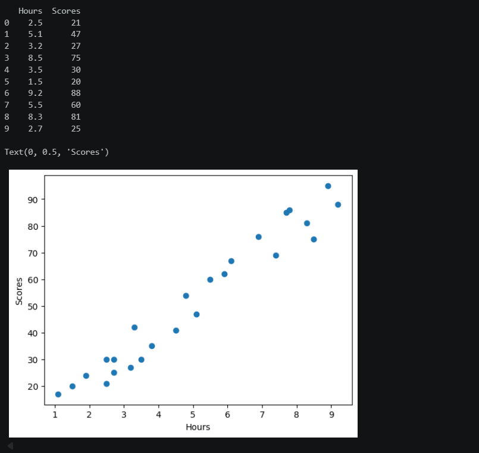
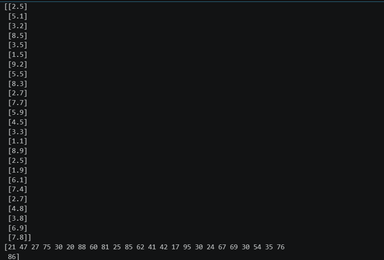
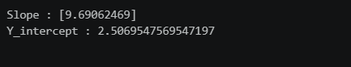
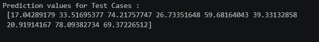
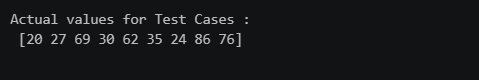
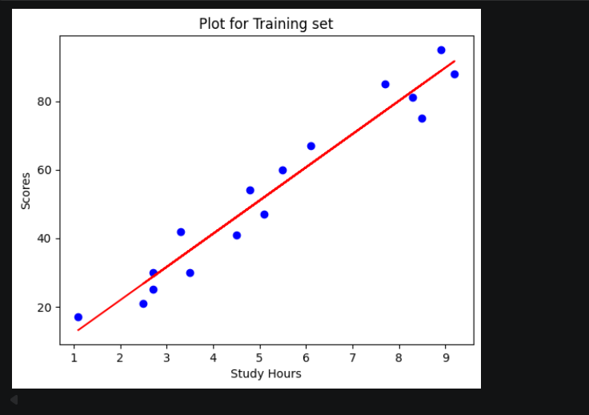
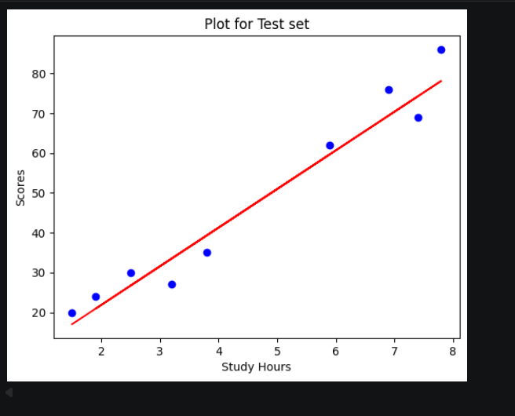
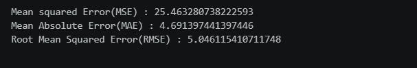

# Implementation-of-Simple-Linear-Regression-Model-for-Predicting-the-Marks-Scored

## AIM:
To write a program to predict the marks scored by a student using the simple linear regression model.

## Equipments Required:
1. Hardware – PCs
2. Anaconda – Python 3.7 Installation / Jupyter notebook

## Algorithm
1. Import the Libraries required.
2. Set variables for dataset values and split the training and test data.
3. Import the linear regression model from sklearn.
4. Predict the values using the model.
5. Plot the graph for training and test data and compare the results.
6. Calculate MSE,MAE,RMSE using the sklearn.metrics libraries.

## Program:
```
/*
Program to implement the simple linear regression model for predicting the marks scored.
Developed by: Santhosh Kumar O
RegisterNumber: 212225040380
import pandas as pd
import numpy as np
import matplotlib.pyplot as plt
#import libraries to find mae, mse

#read csv file
df=pd.read_csv("student_scores.csv")
#displaying the content in datafile
print(df.head(10))
plt.scatter(df["Hours"],df["Scores"])
plt.xlabel("Hours")
plt.ylabel("Scores")

# Segregating data to variables
X=df.iloc[:,:-1].values
Y=df.iloc[:,1].values
print(X)
print(Y)

#splitting train and test data
from sklearn.model_selection import train_test_split
X_train,X_test,Y_train,Y_test=train_test_split(X,Y,test_size=1/3,random_state=0)

#import linear regression model and fit the model with the data
from sklearn.linear_model import LinearRegression
reg=LinearRegression()
reg.fit(X_train,Y_train)
Y_Pred=reg.predict(X_test)

#displaying predicted values
print("Predicted values for Test Cases :\n",Y_Pred)

#displaying actual values
print("Actual values for Test Cases :\n",Y_test)

#graph plot for training data
plt.scatter(X_train,Y_train,color='blue')
plt.plot(X_train,reg.predict(X_train),color='red')
plt.title("Plot for Training set")
plt.xlabel("Study Hours")
plt.ylabel("Scores")
plt.show()

#graph plot for test data
plt.scatter(X_test,Y_test,color='blue')
plt.plot(X_test,reg.predict(X_test),color='red')
plt.title("Plot for Test set")
plt.xlabel("Study Hours")
plt.ylabel("Scores")
plt.show()

#find mae,mse,rmse

from sklearn.metrics import mean_absolute_error,mean_squared_error
mse=mean_squared_error(Y_test,Y_Pred)
mae=mean_absolute_error(Y_test,Y_Pred)
rmse=np.sqrt(mse)
print("Mean squared Error(MSE) :",mse)
print("Mean Absolute Error(MAE) :",mae)
print("Root Mean Squared Error(RMSE) :",rmse)
*/
```

## Output:








## Result:
Thus the program to implement the simple linear regression model for predicting the marks scored is written and verified using python programming.